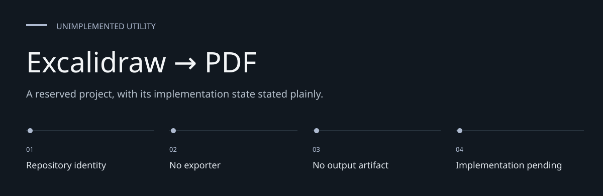
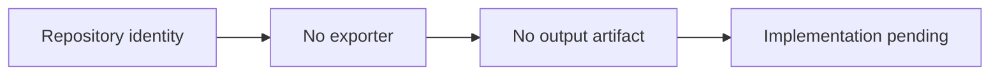

# Excalidraw → PDF

**A reserved project, with its implementation state stated plainly.**

A repository reserved for an Excalidraw-to-PDF utility.

[Architecture](docs/ARCHITECTURE.md) · [Evaluation guide](docs/EVALUATION.md)

**Contents:** [The challenge](#the-challenge) · [Walkthrough](#walk-through-the-project) ·
[Implementation](#implementation-state) · [Design choices](#engineering-choices) ·
[Next evidence](#next-evidence-to-collect)

---

## The challenge

An export utility needs an input contract, rendering path and output validation. This repository
currently reserves the project identity but contains none of those implementation pieces, so its
useful documentation is a clear statement of present scope.

## System at a glance

## Walk through the project

### 1. Inspect tracked contents

The repository contains documentation only. There is no source entry point or installable exporter.

### 2. Identify absent contracts

Input formats, rendering fidelity, PDF options and error behavior have not been established by code.

### 3. Avoid assumed installation

There is no dependency manifest, CLI or executable test to run. A repository clone does not
provide conversion capability.

### 4. Define the first evidence

A future implementation would need a known input/output case and documented limitations before
claiming export support. That is proposed work, not a committed feature.

## Current state

The repository contains this README only. There is no exporter implementation, dependency
manifest, command-line entry point or test suite to install or run.

## Scope

The repository name describes the intended utility. Supported input formats, rendering fidelity,
PDF options and installation steps have not been implemented or established in this checkout.

## Verification

This documentation reflects the tracked repository contents. No export was performed.

## Engineering choices

**Empty state is explicit.** A name is not an implementation claim.

**No invented commands.** Setup instructions require a real entry point and dependencies.

**Proposed work is labeled.** Future acceptance criteria do not imply delivered functionality.

## Implementation state

| State | Current evidence |
| --- | --- |
| Present | Project documentation |
| Not present | Exporter source and dependencies |
| Not present | Supported input/output contract |
| Not present | Tests or exported example PDF |

The [architecture guide](docs/ARCHITECTURE.md) maps these statements to source entry points.
The [evaluation guide](docs/EVALUATION.md) separates inspection, executable checks and
domain validation, with the next evidence needed for each project.

## Next evidence to collect

- Choose and document the intended input contract.
- Implement one rendering/export path.
- Add a reproducible input/PDF comparison before advertising support.
