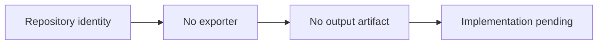

# Excalidraw → PDF — Architecture and implementation

This guide follows the tracked implementation. Proposed work is identified separately.

## The problem and the system boundary

An export utility needs an input contract, rendering path and output validation. This repository
currently reserves the project identity but contains none of those implementation pieces, so its
useful documentation is a clear statement of present scope.

## Processing path

## End-to-end behavior

### 1. Inspect tracked contents

The repository contains documentation only. There is no source entry point or installable exporter.

### 2. Identify absent contracts

Input formats, rendering fidelity, PDF options and error behavior have not been established by code.

### 3. Avoid assumed installation

There is no dependency manifest, CLI or executable test to run. A repository clone does not
provide conversion capability.

### 4. Define the first evidence

A future implementation would need a known input/output case and documented limitations before
claiming export support. That is proposed work, not a committed feature.

## Design choices and consequences

### Empty state is explicit

A name is not an implementation claim.

### No invented commands

Setup instructions require a real entry point and dependencies.

### Proposed work is labeled

Future acceptance criteria do not imply delivered functionality.

## Source entry points

## Implementation state

| State | Evidence boundary |
| --- | --- |
| Present | Project documentation |
| Not present | Exporter source and dependencies |
| Not present | Supported input/output contract |
| Not present | Tests or exported example PDF |

“Present” means tracked source or assets exist. It does not mean a production or domain
validation has passed. See [Evaluation](EVALUATION.md) for reproducible checks and limits.
